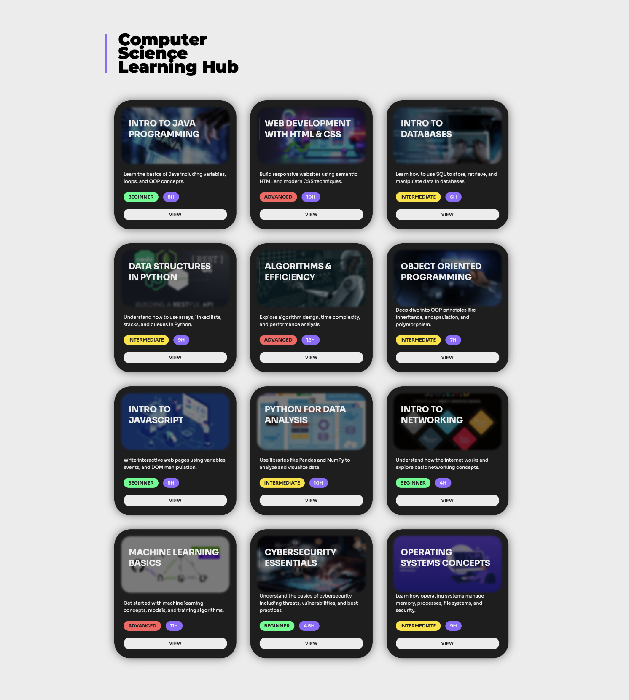

# Web Development Project 1 - *Board*

Submitted by: **Justin**

This web app: **This web app: displays a curated board of educational courses tailored for a creative and tech-savvy audience. Each course is presented as a visually distinct card featuring a blurred image background, title, difficulty level, duration, and a brief description. The design mimics a modern UI aesthetic with responsiveness in mind.**

Time spent: **12** hours spent in total, approximately.

## Required Features

The following **required** functionality is completed:

- [x] **The app has a cohesive, unique theme for events or resources relevant to a specific community**
  - [x] Header/title describing the theme is displayed
- [x] **At least 10 unique events or resources are displayed in a responsive card format**
  - [x] There are at least 10 cards displayed 
  - [x] The cards should be displayed in an organized format (ex. a grid, or in one line)
  - [x] Each card should include some information about the event or resource

The following **optional** features are implemented:

- [x] Buttons or links to a related resources are on each card component
  - [x] All cards have buttons or links in addition to text
- [x] The site is responsive for both desktop and mobile formats
  - [x] Web app is shown in a mobile format

The following **additional** features are implemented:

* [x] Use of CSS variables via :root for a better color and font management
* [x] Animated hover effects for card interaction

## Video Walkthrough

Here's a walkthrough of implemented required features:

GIF created with
[Kap](https://getkap.co/) for macOS

## Notes

Describe any challenges encountered while building the app.

 - [ ] Matching the layout from a Figma design exactly with CSS.
    - [ ] Making sure that the card content (title, image, blur) was stacked and positioned properly.
- [ ] Avoiding horizontal scroll and ensuring proper alignment of the title with the card grid.
    - [ ] Working with React and Vite was a bit challenging at first, since it was my first time using them. 

## License

    Copyright [2025] [Justin Mora]

    Licensed under the Apache License, Version 2.0 (the "License");
    you may not use this file except in compliance with the License.
    You may obtain a copy of the License at

        http://www.apache.org/licenses/LICENSE-2.0

    Unless required by applicable law or agreed to in writing, software
    distributed under the License is distributed on an "AS IS" BASIS,
    WITHOUT WARRANTIES OR CONDITIONS OF ANY KIND, either express or implied.
    See the License for the specific language governing permissions and
    limitations under the License.
